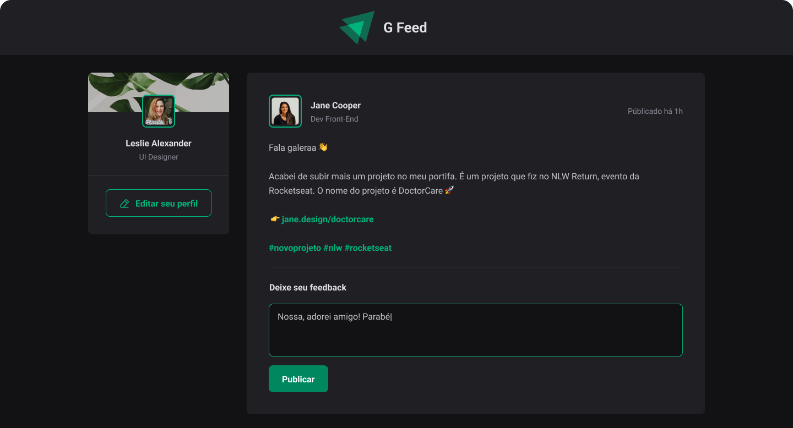

<h1 align="center"> Gfeed </h1>

Projeto do cápitulo 1 do modulo Fundamentos da certificação Ignite-Rocketseat.

  <a href="#-tecnologias">Tecnologias</a>&nbsp;&nbsp;&nbsp;|&nbsp;&nbsp;&nbsp;
  <a href="#-projeto">Projeto</a>&nbsp;&nbsp;&nbsp;|&nbsp;&nbsp;&nbsp;
  <a href="#-layout">Layout</a>&nbsp;&nbsp;&nbsp;|&nbsp;&nbsp;&nbsp;
  <a href="#memo-licença">Licença</a>

  

 

  

## 🚀 Tecnologias

Esse projeto foi desenvolvido com as seguintes tecnologias:

- [ReactJS](https://https://react.dev/)
- [Typescript](https://www.typescriptlang.org/)
- [Vite](https://vitejs.dev/)
- CSS Module

## 💻 Projeto

O Gfeed é uma página web com feed semelhante a rede sociais da atualidade.

## 🔖 Layout

Você pode visualizar o layout do projeto através [DESSE LINK](https://www.figma.com/design/9mTWlAM3ZpHOEQfrE6bmhL/Ignite-Feed-(My)?node-id=26-12&t=gAzjhJtH0TnSlHmO-0/duplicate). É necessário ter conta no [Figma](https://figma.com) para acessá-lo.

## :memo: Licença

Esse projeto está sob a licença MIT.

---

Feito com ♥ por mim junto com a Rocketseat
